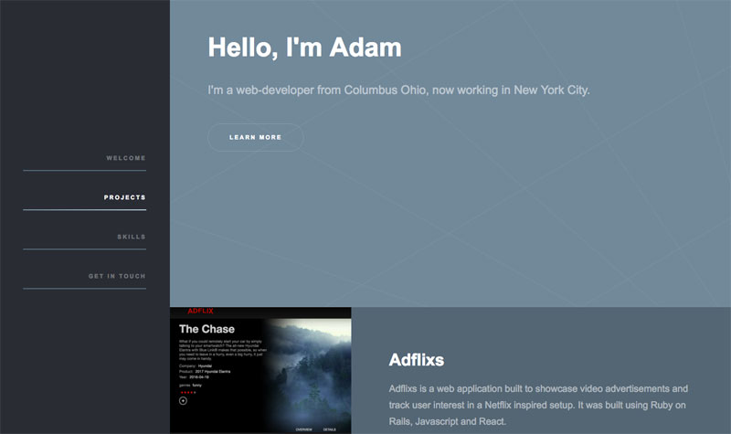

##**Adam Keller's Portfolio**

This is a quick mock up of my portfolio site. There is a lot of work to do in regards to the language being used, the images representing the work, and of course finishing up the work to be loaded up here.

###**Views**

###ToDo
* [ ] Get the initial projects ready for attaching
* [ ] Polish up the Tetris image and description
* [ ] Polish up the EbokianServer image and description
* [ ] Add Email submission to the form, or design the last group
* [ ] Create a brief opening statement section where I say a bit about me
* [ ] Polish up all the content on the site to tell a single story
